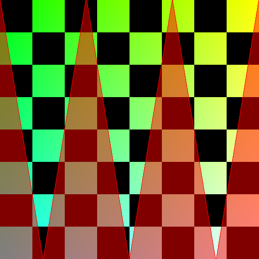
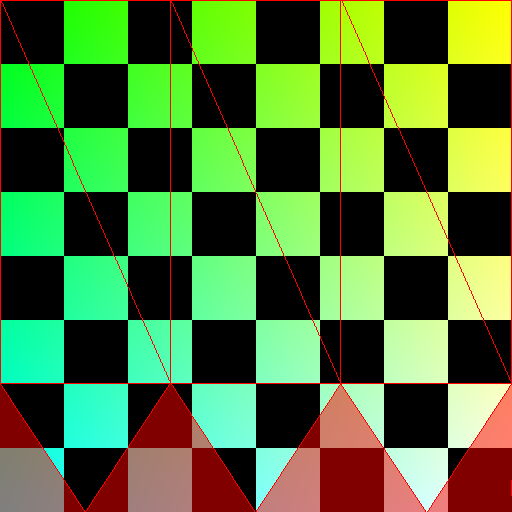
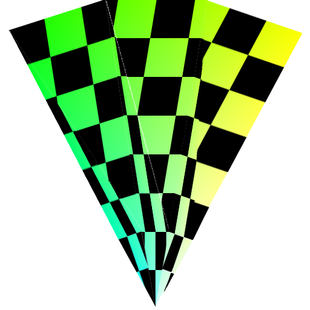
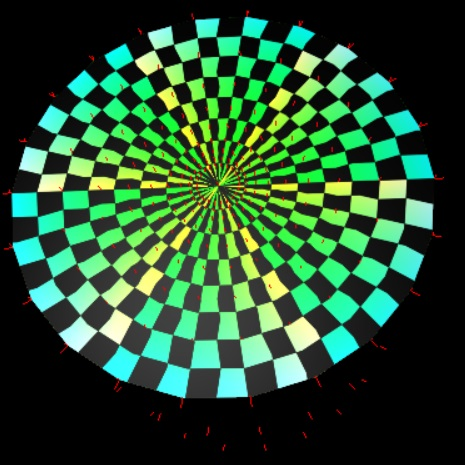
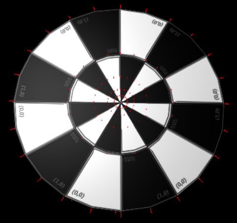

# Cilindro

## Geometria

A geometria do cilindro é uma bem fácil de fazer.
Basta iterar da base até o topo criando os vértices e depois iterar novamente para criar as faces.

## Normais

Quando queremos iluminar o clindro temos que calcular as normais,
sendo que as das faces de baixo apontam todas para -z,
as da face de cima apontam todas para +z,
e as outras apontam na mesma direção que o próprio vértice em relação à origem.

## Texturização

Já para a texturização começam os problemas maiores.
A texturização da lateral do cilindro é bem tranquila,
basta mapear a textura linearmente usando coordenadas polares para u,
e coordenadas euclidianas para v.

É na base e no topo do cilindro que está 90% do trabalho.
O mapeamento das texturas nessas faces não pode ser linear.

### Mapeamento simples do círculo

Uma das formas de mapear consta em simplesmente ignorar a linearidade,
e mapear em forma de triângulos na textura, o que irá jogar fora uma parte
da textura.

Infelizmente isso não produz um resultado bom pois a textura fica
com várias descontinuidades ao ser mapeada:

**Veja o exemplo:** [Problemas com a face circular](9a-texture-wrong)

### Mapeamento com um anel e um círculo pequeno concêntricos

Tentei então fazer o mapeamento considerando a parte externa do círculo
como sendo um anel, cobrindo o centro do anel com um círculo menor,
de tal forma que as descontinuidades não pudessem ser percebidas.

Isso também tem problemas, agora a textura fica distorcida por causa
da forma com que os triângulos são mapeados:

**Veja o exemplo:** [Tentativa de correção com divisão em anel + círculo pequeno](9b-texture-wrong-2)

### Mapeamento com vários anéis e um círculo pequeno concêntricos

A melhor solução foi criar uma série de anéis concêntricos com um círculo
pequeno no centro. Isso ainda deixou alguns traços de distorção, como pode ser visto abaixo:

**Veja o exemplo:** [Correção com divisão em anéis de potências de fração](9c-texture)

### Mapeamento com vários anéis e um círculo pequeno concêntricos e textura alinhada

É possível mitigar essas distorções alinhando as divisões da textura com
os triângulos, o que elimina completamente o problema.

**Versão final:** [Texturizando o cilindro](9-cylider-texture)

Entretanto, nem toda textura é bonitinha como as que usei aqui.
No caso de texturas complicadas o jeito é subdividir em mais
e mais partes até que o problema seja imperceptível.

# Texture mapping

- [Texture](https://threejs.org/docs/#api/en/textures/Texture.repeat) @threejs.org
    - [three.js - webgl - basis texture loader](https://threejs.org/examples/#webgl_loader_texture_basis)
    - [Código no github](https://github.com/mrdoob/three.js/blob/master/examples/webgl_loader_texture_basis.html)
- [A brief introduction to texture mapping](https://discoverthreejs.com/book/1-first-steps/4-textures-intro/) @discoverthreejs.com
    - [Código no codesandbox](https://codesandbox.io/s/github/looeee/discoverthree.com-examples/tree/master/1-first-steps/4-textures-intro?from-embed)
- [Add Texture to custom three.js Geometry](https://stackoverflow.com/questions/55461909/add-texture-to-custom-three-js-geometry)

# UV Map Grids

Eu usei algumas texturas que não são minhas nestes exemplos.
Aqui estão algumas informações sobre como econtrá-las.

Pesquisas no Google por imagens:

- [Google image search: uv test texture](https://www.google.com/search?tbm=isch&q=uv+test+texture)
- [Google image search: uv map texture](https://www.google.com/search?tbm=isch&q=uv+map+texture)
- [Google image search: uv_test_bw](https://www.google.com/search?tbm=isch&q=uv_test_bw)

Sites com images para testes de mapeamento de texturas:

- [Texture Coordinates #UV Map Grids](http://wiki.polycount.com/wiki/Texture_Coordinates#UV_Map_Grids) @wiki.polycount.com
- [UV Checker Texture](https://www.oxpal.com/uv-checker-texture.html) @www.oxpal.com

# Texturização avançada

- [Dica Rápida: Como Renderizar para uma Textura Em Three.js](https://gamedevelopment.tutsplus.com/pt/tutorials/quick-tip-how-to-render-to-a-texture-in-threejs--cms-25686)
    - [Código no codepen](https://codepen.io/tutsplus/pen/eJGzzK)
- [Using ShaderToy shaders as texture](https://threejsfundamentals.org/threejs/lessons/threejs-shadertoy.html)
