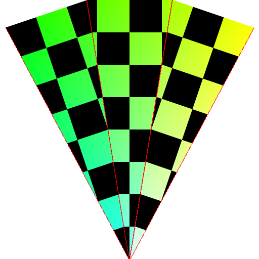

# Cilindro

A geometria do cilindro é uma bem fácil de fazer.
Basta iterar da base até o topo criando os vértices e depois iterar novamente para criar as faces.

Quando queremos iluminar o clindro temos que calcular as normais,
sendo que as das faces de baixo apontam todas para -z,
as da face de cima apontam todas para +z,
e as outras apontam na mesma direção que o próprio vértice em relação à origem.

Já para a texturização começam os problemas maiores.
A texturização da lateral do cilindro é bem tranquila,
basta mapear a textura linearmente usando coordenadas polares para u,
e coordenadas euclidianas para v.

É na base e no topo do cilindro que está 90% do trabalho.
O mapeamento das texturas nessas faces não pode ser linear.

Uma das formas de mapear consta em simplesmente ignorar a linearidade,
e mapear em forma de triângulos na textura, o que irá jogar fora uma parte
da textura.

Infelizmente isso não produz um resultado bom pois a textura fica
com várias descontinuidades ao ser mapeada:

**Veja o exemplo:** [Problemas com a face circular](9a-texture-wrong)

Tentei então fazer o mapeamento considerando a parte externa do círculo
como sendo um anel, cobrindo o centro do anel com um círculo menor,
de tal forma que as descontinuidades não pudessem ser percebidas.

Isso também tem problemas, agora a textura fica distorcida por causa
da forma com que os triângulos são mapeados:

**Veja o exemplo:** [Tentativa de correção com divisão em anel + círculo pequeno](9b-texture-wrong-2)

A melhor solução foi criar uma série de anéis concêntricos com um círculo
pequeno no centro. Isso ainda deixou alguns traços de distorção,
mas é possível mitigar isso alinhando as divisões da textura com
os triângulos, o que elimina completamente o problema.

**Veja o exemplo:** [Correção com divisão em anéis de potências de fração](9c-texture)

Entretanto, nem toda textura é bonitinha como as que usei aqui.
No caso de texturas complicadas o jeito é subdividir em mais
e mais partes até que o problema seja imperceptível.

**Versão final:** [Texturizando o cilindro](9-cylider-texture)

# Texture mapping

- [Texture](https://threejs.org/docs/#api/en/textures/Texture.repeat) @threejs.org
- [A brief introduction to texture mapping](https://discoverthreejs.com/book/1-first-steps/4-textures-intro/) @discoverthreejs.com

# UV Map Grids

- [Google image search: uv test texture](https://www.google.com/search?tbm=isch&q=uv+test+texture)
- [Google image search: uv map texture](https://www.google.com/search?tbm=isch&q=uv+map+texture)
- [Google image search: uv_test_bw](https://www.google.com/search?tbm=isch&q=uv_test_bw)
- [Texture Coordinates #UV Map Grids](http://wiki.polycount.com/wiki/Texture_Coordinates#UV_Map_Grids) @wiki.polycount.com
- [UV Checker Texture](https://www.oxpal.com/uv-checker-texture.html) @www.oxpal.com
